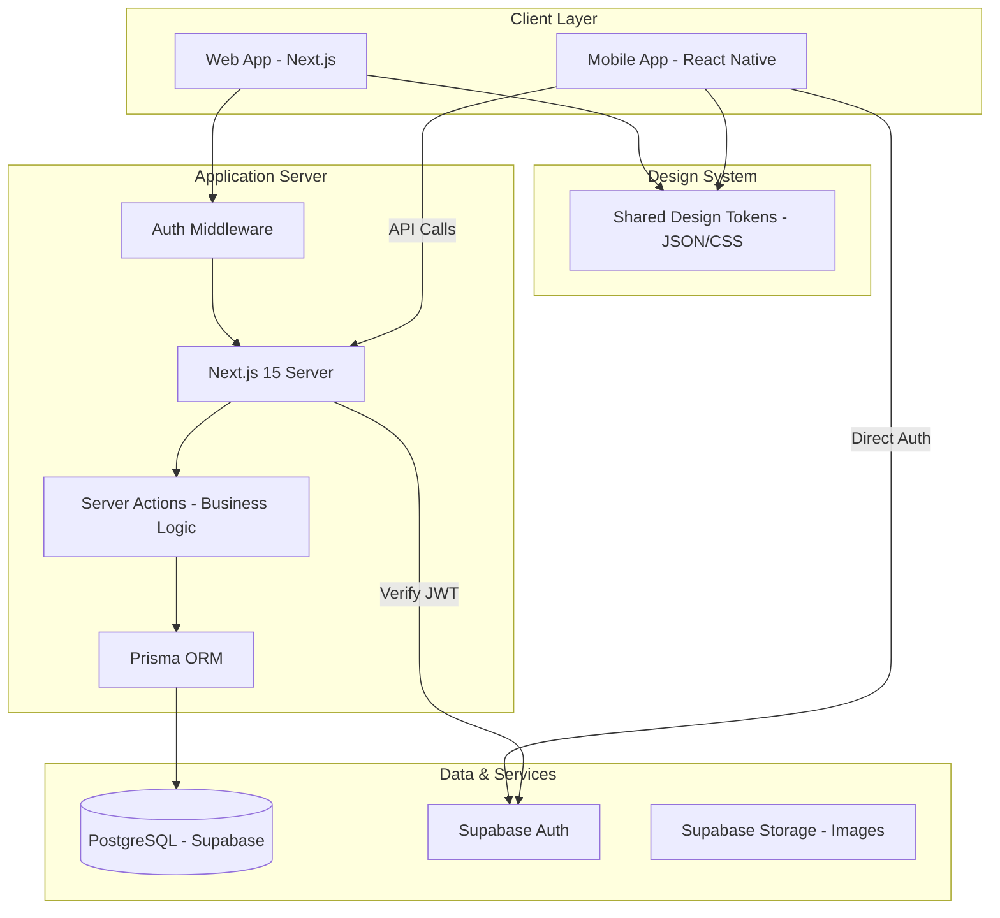

# Kiến trúc Hệ thống (System Architecture)

> Tài liệu mô tả kiến trúc tổng thể, luồng dữ liệu và các thành phần kỹ thuật của hệ thống Vivu Travel.

---

## 1. Tổng quan Kiến trúc (High-Level Design)

Hệ thống được thiết kế theo mô hình **Client-Server** hiện đại, sử dụng Next.js làm lõi cho cả Frontend Web và API tầng trung gian (Server Actions), kết hợp với Supabase cho Backend-as-a-Service.

---

## 2. Thành phần Kỹ thuật (Tech Stack)

### Core Technologies
- **Main Framework:** Next.js 15 (App Router).
- **Language:** TypeScript (Strict mode).
- **Styling:** Tailwind CSS v4 + HeroUI (Design System).
- **Database:** PostgreSQL via Supabase.
- **ORM:** Prisma v6.

### Services & Integrations
- **Authentication:** Supabase Auth (Email, Social).
- **File Storage:** Supabase Buckets (Tour images, Avatars).
- **Deployment:** Vercel (Web), App Store/Play Store (Mobile).
- **Payment:** VNPay / MoMo API (Planned).
- **Infrastructure:** Edge Computing (Middleware), Serverless Functions.

---

## 3. Luồng Dữ liệu (Data Flow)

### Website Request Flow
1. **Request:** Người dùng truy cập URL.
2. **Middleware:** Kiểm tra session & phân quyền (Role check cho `/admin`).
3. **Data Fetching:** Next.js Server Components gọi Prisma để lấy dữ liệu trực tiếp từ DB.
4. **Rendering:** HTML được render phía server (SSR) và gửi về client.
5. **Hydration:** React hydrate phía client, kích hoạt các component HeroUI và Framer Motion.

### Admin Mutation Flow (Server Actions)
1. **Action:** Admin submit form (VD: Cập nhật SEO).
2. **Security:** Server Action gọi `requireAdmin()` check role.
3. **Database:** Prisma thực hiện `update/upsert`.
4. **Revalidation:** `revalidatePath("/")` để xóa cache trang chủ, hiển thị dữ liệu mới ngay lập tức.
5. **Feedback:** Trả về kết quả cho UI client hiển thị Toast notification.

---

## 4. Bảo mật (Security)

- **Authentication:** JWT được lưu trong HttpOnly Cookie bảo mật XSS.
- **Role-Based Access Control (RBAC):**
    - `USER`: Truy cập public pages, booking, profile.
    - `ADMIN`: Toàn quyền truy cập `/admin`.
- **Data Safety:** Prisma tự động sanitize các câu query, chống SQL Injection.
- **Environment:** Toàn bộ keys nhạy cảm (`DATABASE_URL`, `SUPABASE_SECRET`) lưu trong Server-side env vars.
