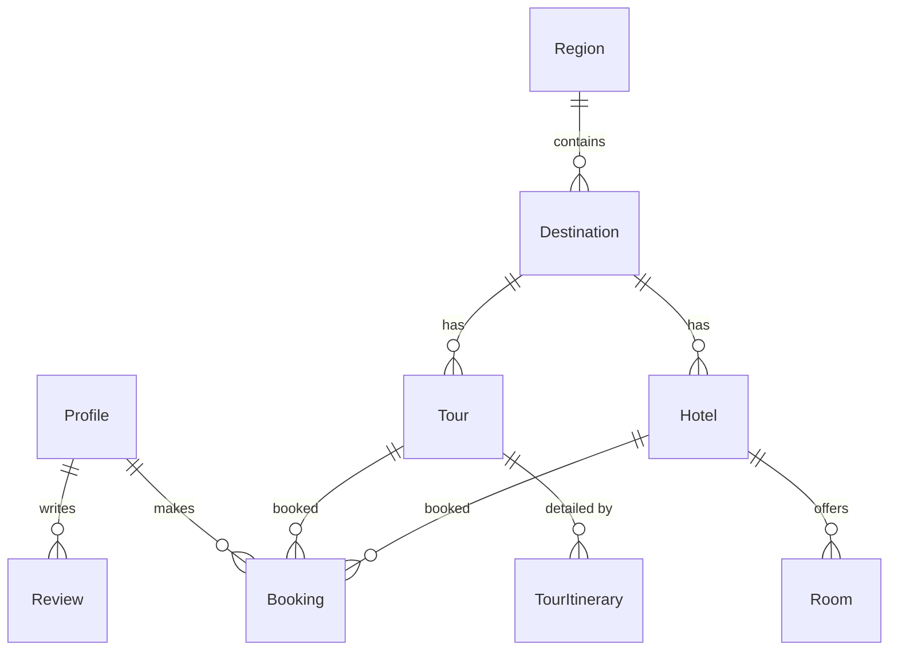

# Thiết kế Cơ sở dữ liệu (Database Schema)

> Tài liệu mô tả cấu trúc bảng, mối quan hệ và các mô hình dữ liệu chính xác nhất (Prisma 6.9).

---

## 1. Thực thể Chính (Core Entities)

### Hệ thống Người dùng & Profile
- **Role (Enum):** `USER`, `ADMIN`.
- **Profile:** Lưu thông tin người dùng được quản lý bởi Supabase Auth ID. Bao gồm `displayName`, `avatarUrl`, `role`.

### Hệ thống Tour & Điểm đến
- **Region:** Vùng miền (Bắc, Trung, Nam).
- **Destination:** Thành phố/Điểm đến (Hạ Long, Đà Lạt...). Thuộc về 1 `Region`.
- **Hotel:** Thông tin khách sạn. Thuộc về 1 `Destination`.
- **Tour:** Thông tin tour du lịch (giá, thời gian). Thuộc về 1 `Destination`.
- **TourItinerary:** Lịch trình chi tiết từng ngày của Tour.

### Hệ thống Nghiệp vụ (Booking)
- **Booking:** Đơn đặt (Hotel hoặc Tour). Liên kết với `Profile` và `Hotel/Tour`.
- **BookingStatus (Enum):** `PENDING`, `CONFIRMED`, `PAID`, `CANCELLED`, `COMPLETED`.

### Hệ thống Quản trị (Settings)
- **HomeSetting:** Cấu hình động cho trang chủ (Hero, Promos...).
- **SystemSetting:** Cấu hình SEO, Theme, Global Info.
- **LegalContent:** Quản lý nội dung Điều khoản, Chính sách.

---

## 2. Chi tiết Models (Prisma)

```prisma
// Ví dụ các models quan trọng
model Profile {
  id          String   @id // Supabase User ID
  email       String   @unique
  role        Role     @default(USER)
  displayName String?
  avatarUrl   String?
  bookings    Booking[]
  // ... timestamps
}

model Tour {
  id            String   @id @default(uuid())
  title         String
  slug          String   @unique
  description   String?
  price         Decimal
  duration      String
  destination   Destination @relation(fields: [destinationId], references: [id])
  destinationId String
  itineraries   TourItinerary[]
  isActive      Boolean  @default(true)
}

model HomeSetting {
  id    String @id @default(uuid())
  key   String @unique // "hero_banner", "stats"
  value Json   // Cấu hình linh hoạt
  isActive Boolean @default(true)
}
```

---

## 3. Sơ đồ Quan hệ (ER Diagram)



---

## 4. Quy trình Migration

1. **Thay đổi Schema:** Chỉnh sửa file `prisma/schema.prisma`.
2. **Tạo Migration:** `npx prisma migrate dev --name name_of_change`.
3. **Deploy:** `npx prisma migrate deploy` (tự động trên CI/CD).
