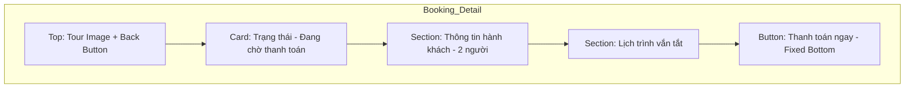

# Design Inputs: Mobile App (Customer-Only)

Tài liệu này đặc tả chi tiết giao diện (Inputs) cho ứng dụng di động dành cho khách hàng.

---

## 1. Màn hình: Trang chủ (Home)

### Thành phần (Components)
- **Header:** Background trong suốt, Logo "Vivu" trắng (Dark mode) hoặc xanh (Light mode), Icon Thông báo & Wishlist ở góc phải.
- **Search Bar:** Bo tròn `full`, đổ bóng `lg`. Placeholder: "Bạn muốn đi đâu?".
- **Banner Carousel:** Ảnh điểm đến nổi bật với hiệu ứng mờ (Overlay) và tiêu đề tour.
- **Quick Links (Icon Grid):** Tour giá rẻ, Villa, Khách sạn, Vé máy bay.
- **Featured Destinations:** Danh sách nằm ngang (Horizontal Scroll) với ảnh tròn và tên vùng miền.

---

## 2. Màn hình: Đăng nhập & Đăng ký (Auth)

### UI Specs
- **Background:** Sử dụng ảnh phong cảnh Việt Nam mờ (Blur 10px).
- **Form Card:** Bo tròn `3xl` (bottom), nền trắng (hoặc dark slate) 90% opacity.
- **Inputs:** Viền mỏng, active state màu `primary`.
- **Buttons:** 
  - Primary button: Gradient `primary` to `secondary`.
  - Social login: Apple & Google icons (Minimalist style).

---

## 3. Màn hình: Chi tiết Tour (Product Detail)

### Layout
- **Top:** Ảnh bìa lớn (Sticky header khi scroll).
- **Sticky Footer:** Hiển thị giá và nút "Đặt ngay" lớn.
- **Content:**
  - Rating & Location badge.
  - Lịch trình (Itinerary) dạng Timeline dọc.
  - Section Review: Carousel ảnh khách đã đi.

---

## 4. Màn hình: Đơn đặt chỗ (My Bookings)

### UI Specs
- **Tabs:** Sắp tới, Đã hoàn thành, Đã hủy.
- **Booking Card:** 
  - Hiển thị mã đơn hàng (ID).
  - Trạng thái màu sắc: `success` (Đã thanh toán), `warning` (Chờ xử lý).
  - Nút "Xem voucher" nổi bật nếu đã paid.

---

## 5. Màn hình: Hồ sơ (Profile)

### Thành phần
- **Header:** Avatar tròn viền `primary`, User Name & Rank (Vàng/Bạc/Kim cương).
- **Menu List:**
  - Thông tin cá nhân.
  - Cài đặt thông báo.
  - Trung tâm hỗ trợ.
  - Đăng xuất (Màu đỏ `danger`).

---

---

## 6. Màn hình: Tìm kiếm & Kết quả (Search & Filters)

### UI Specs
- **Header:** Thanh search luôn nổi trên cùng (Sticky).
- **Filter Bar:** Một thanh lăn (Horizontal scroll) chứa các pill: "Giá thấp", "Phổ biến", "Gần tôi", "⭐ 4.5+".
- **Search Result Card:**
  - Ảnh lớn (2:1 ratio).
  - Badge tag: "Bán chạy" hoặc "Ưu đãi".
  - Hiển thị giá nổi bật màu `primary`.

---

## 7. Màn hình: Quy trình Đặt đơn (Booking Flow)

### Step 1: Chọn dịch vụ & Ngày
- Lịch (Calendar) tùy chỉnh, highlight các ngày có giá tốt.
- Bộ chọn số lượng khách (Stepper +/-).

### Step 2: Thông tin thanh toán
- Danh sách các cổng thanh toán (VNPay, MoMo) với logo chính thức.
- Tóm tắt giá (Price Breakdown) hiển thị rõ ràng trước khi bấm "Thanh toán".

### Step 3: Xác nhận (Success)
- Animation "Tick xanh" đổ bóng 3D.
- Nút "Xem vé của tôi" (Primary) và "Về trang chủ" (Secondary).

---

## 8. Màn hình: Đánh giá (Review & Rating)

### UI Specs
- Picker 5 sao với animation scale khi chọn.
- Khu vực upload ảnh: Cho phép chọn tối đa 5 ảnh, có preview thumbnail.
- Nút "Gửi đánh giá" chỉ active khi đã nhập nội dung > 20 ký tự.

---

## 9. Sơ đồ Wireframe (Visual Mockups)

### 9.1. Màn hình Home (Wireframe)
```mermaid
graph TD
    subgraph Mobile_Home
    A[Header: Logo Vivu + Notification] --> B[Search Bar: Bạn muốn đi đâu?]
    B --> C[Banner: Khám phá Vịnh Hạ Long]
    C --> D[Icon Grid: Tour | Hotel | Flight]
    D --> E[Section: Điểm đến phổ biến - Horizontal Scroll]
    E --> F[Bottom Nav: Home | Search | Bookings | Profile]
    end
```

### 9.2. Màn hình Auth (Login/Register)
```mermaid
graph TD
    subgraph Auth_Flow
    G[Background: Scenic Image Blur] --> H[Card: Chào mừng bạn]
    H --> I[Input: Email / Phone]
    I --> J[Input: Mật khẩu]
    J --> K[Button: Đăng nhập - Primary Gradient]
    K --> L[Link: Quên mật khẩu? / Đăng ký mới]
    L --> M[Social Auth: Google | Apple Icons]
    end
```

### 9.3. Màn hình Booking Detail (Tracking)


---

## 10. Màn hình: Thông báo (Notifications)

### UI Specs
- **Tabs:** "Cá nhân" (Cập nhật đơn hàng) và "Khuyến mãi".
- **Notification Item:**
  - Icon đặc trưng theo loại (Ví dụ: Icon Ví tiền cho thanh toán, Icon Palmtree cho tour mới).
  - Trạng thái `unread` có chấm tròn màu `primary`.
  - Hỗ trợ **Push Notification** với deeplink dẫn thẳng vào màn hình chi tiết.

---

## 11. Màn hình: Hỗ trợ & Chat (Support)

### UI Specs
- **Live Chat Interface:**
  - Bubble chat bo tròn cao.
  - Hỗ trợ gửi ảnh chụp lỗi hoặc vé.
  - Tích hợp **Messenger/Zalo SDK** cho phép chuyển đổi kênh liên lạc nhanh.
- **FAQ Section:** Danh sách các câu hỏi thường gặp (Accordion style).

---

## 🎨 Trải nghiệm Người dùng (UX Mobile)
- **Lazy Loading:** Sử dụng skeleton shimmer cho các list tour dài.
- **Empty States:** Hình minh họa vector (Futuristic style) khi không tìm thấy kết quả hoặc wishlist trống.
- **Micro-interactions:** 
  - Thả tim (Wishlist) có animation "nổ" nhẹ.
  - Pull-to-refresh với icon Vivu xoay tròn.
