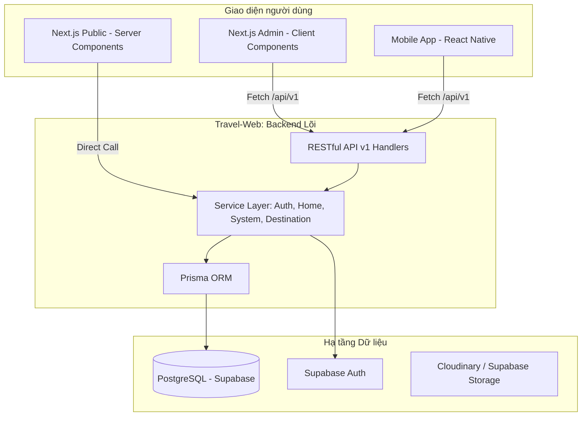

# Kiến trúc Hệ thống (System Architecture)

> Tài liệu mô tả kiến trúc tổng thể, luồng dữ liệu và các thành phần kỹ thuật của hệ thống Vivu Travel.

---

## 1. Tổng quan Kiến trúc (High-Level Design)

Hệ thống được thiết kế theo mô hình **Client-Server** hiện đại, sử dụng Next.js làm lõi cho cả Frontend Web và API tầng trung gian (Server Actions), kết hợp với Supabase cho Backend-as-a-Service.

---

## 2. Thành phần Kỹ thuật (Tech Stack)

### Core Technologies
- **Main Framework:** Next.js 15 (App Router).
- **Language:** TypeScript (Strict mode).
- **Styling:** Tailwind CSS v4 + HeroUI (Design System).
- **Database:** PostgreSQL via Supabase.
- **ORM:** Prisma v6.

### Services & Integrations
- **Authentication:** Supabase Auth (Email, Social).
- **File Storage:** Supabase Buckets (Tour images, Avatars).
- **Deployment:** Vercel (Web), App Store/Play Store (Mobile).
- **Payment:** VNPay / MoMo API (Planned).
- **Infrastructure:** Edge Computing (Middleware), Serverless Functions.

---

## 3. Luồng Dữ liệu (Data Flow)

### Website Request Flow (Public)
1. **Request:** Người dùng truy cập URL.
2. **Middleware:** Kiểm tra session & phân quyền.
3. **Data Fetching:** Next.js **Server Components** gọi trực tiếp các phương thức từ `Service Layer` (VD: `HomeService.getSettings()`). 
4. **Performance:** Việc gọi trực tiếp Service giúp loại bỏ độ trễ HTTP nội bộ, tối ưu SEO tuyệt đối.

### Admin/Mobile Interaction Flow (REST API)
1. **Action:** User thực hiện tương tác (Login, Lưu cài đặt, CRUD).
2. **Request:** Client/Mobile gửi `Fetch` request đến `/api/v1/*`.
3. **API Handler:** Route Handler nhúng `AuthService` để kiểm tra JWT/Role.
4. **Service:** Handler gọi Logic tương ứng trong `Service Layer`.
5. **Database:** Prisma thực hiện truy vấn DB.
6. **Revalidation:** Hệ thống gọi `revalidatePath` để làm mới cache (On-demand Revalidation).
7. **Response:** Trả về JSON chuẩn cho Client.

---

## 4. Bảo mật (Security)

- **Authentication:** JWT được lưu trong HttpOnly Cookie bảo mật XSS.
- **Role-Based Access Control (RBAC):**
    - `USER`: Truy cập public pages, booking, profile.
    - `ADMIN`: Toàn quyền truy cập `/admin`.
- **Data Safety:** Prisma tự động sanitize các câu query, chống SQL Injection.
- **Environment:** Toàn bộ keys nhạy cảm (`DATABASE_URL`, `SUPABASE_SECRET`) lưu trong Server-side env vars.
