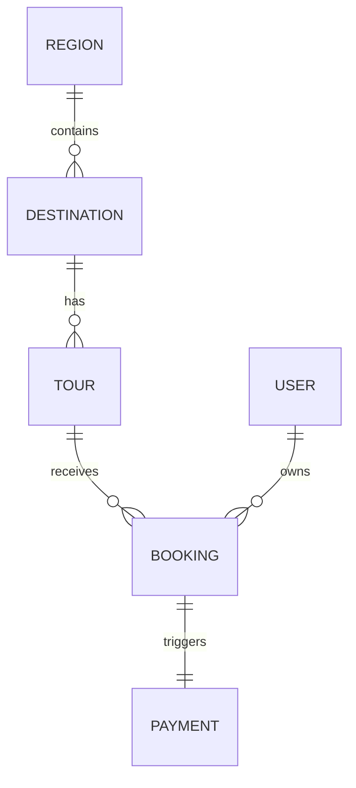

# Thiết kế Cơ sở Dữ liệu Chi tiết (Detailed Schema Design)

Tài liệu này đặc tả chi tiết các bảng (Tables), quan hệ (Relationships) và ràng buộc dữ liệu (Constraints) cho hệ thống Vivu Travel.

## 1. Module Quản trị Nội dung (Content CMS)

### Bảng: `Region` (Vùng miền)
| Field | Type | Constraint | Description |
| :--- | :--- | :--- | :--- |
| `id` | UUID | PK, Default: uuid_generate_v4() | ID duy nhất |
| `code` | String | Unique, Not Null | Mã vùng (e.g. mb, mt, mn) |
| `name` | String | Not Null | Tên hiển thị (Miền Bắc...) |
| `slug` | String | Unique, Not Null | Slug cho SEO |
| `order` | Integer | Default: 0 | Thứ tự hiển thị |

### Bảng: `Destination` (Điểm đến)
| Field | Type | Constraint | Description |
| :--- | :--- | :--- | :--- |
| `id` | UUID | PK | ID duy nhất |
| `regionId` | UUID | FK -> Region(id) | Thuộc vùng miền nào |
| `name` | String | Not Null | Tên địa danh |
| `slug` | String | Unique, Not Null | Slug cho SEO |
| `description`| Text | | Mô tả chi tiết (HTML/MD) |
| `images` | String[] | | Danh sách URL ảnh (Cloudinary) |
| `lat` | Float | | Vĩ độ (Cấu hình Map) |
| `lng` | Float | | Kinh độ (Cấu hình Map) |
| `isFeatured` | Boolean | Default: false | Có hiển thị trang chủ không |

---

## 2. Module Đặt chỗ & Thanh toán (Booking & Payment)

### Bảng: `Tour` (Sản phẩm Tour)
| Field | Type | Constraint | Description |
| :--- | :--- | :--- | :--- |
| `id` | UUID | PK | |
| `destId` | UUID | FK -> Destination(id) | Thuộc điểm đến nào |
| `title` | String | Not Null | Tên Tour |
| `priceAdult` | Decimal | Not Null | Giá người lớn |
| `priceChild` | Decimal | | Giá trẻ em |
| `maxSlots` | Integer | Not Null | Số lượng chỗ tối đa/tour |
| `duration` | String | | Thời gian (e.g. 3 ngày 2 đêm) |

### Bảng: `Booking` (Hành vi đặt chỗ)
| Field | Type | Constraint | Description |
| :--- | :--- | :--- | :--- |
| `id` | UUID | PK | Mã đơn hàng (Format: VV-XXXXXX) |
| `tourId` | UUID | FK | Tour khách đặt |
| `userId` | UUID | FK | Khách hàng (nếu đã login) |
| `customerName`| String | Not Null | |
| `customerEmail`| String | Not Null | |
| `status` | Enum | PENDING/PAID/CANCELLED | Trạng thái đơn hàng |
| `totalAmount` | Decimal | Not Null | Tổng tiền sau voucher |
| `paymentMethod`| Enum | VNPAY/MOMO/BANK | Hình thức thanh toán |

---

## 3. Bản đồ quan hệ (ERD - Mermaid)

---
*Tài liệu kỹ thuật v1.0*
