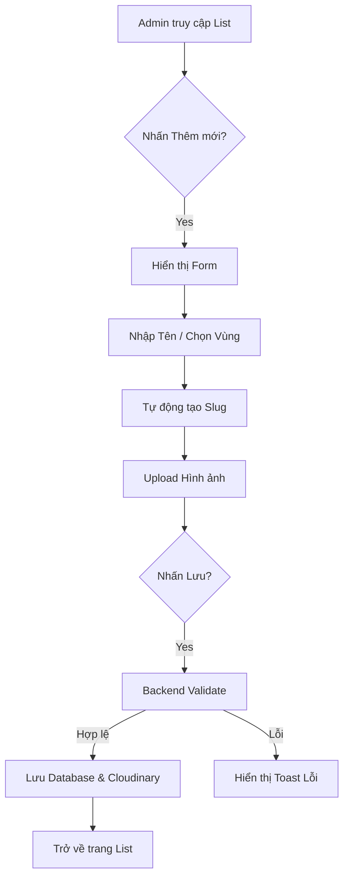

# [Thiết kế Chi tiết] Quản trị Điểm đến (POI Management)

| Phiên bản | Ngày | Sprint | Nội dung thay đổi | Người thực hiện |
| :--- | :--- | :--- | :--- | :--- |
| **v1.0** | 26/03/2026 | [Sprint 2](../../02-quan-ly-sprint/sprint-2-quan-tri-diem-den/01-yeu-cau-nghiep-vu) | Khởi tạo tài liệu thiết kế chi tiết | PO |

---

Tài liệu thiết kế chi tiết cho module Điểm đến, phục vụ Dev trong quá trình lập trình và QA/Tester trong quá trình kiểm thử.

## 1. Sơ đồ Luồng Nghiệp vụ (Flowchart)

## 2. Cấu trúc trường dữ liệu (Field Specs)

Bảng dữ liệu: `Destination`

| Tên trường | Kiểu dữ liệu | Bắt buộc | Ràng buộc | Mô tả |
| :--- | :--- | :---: | :--- | :--- |
| `id` | String | Yes | Primary Key (cuid) | Định danh duy nhất |
| `nameVi` | String | Yes | Max 100 ký tự | Tên tiếng Việt hiển thị |
| `nameEn` | String | No | Max 100 ký tự | Tên tiếng Anh (mặc định=nameVi) |
| `slug` | String | Yes | Unique, ASCII-only | URL thân thiện (e.g. vinh-ha-long) |
| `regionId` | String | Yes | Foreign Key | Liên kết tới bảng `Region` |
| `imageUrl` | String | Yes | URL Cloudinary | Ảnh đại diện chính |
| `description`| Text | No | Rich-text | Mô tả chi tiết (HTML) |
| `isActive` | Boolean | Yes | Default: true | Trạng thái hiển thị |

## 3. Đặc tả Thành phần UI (Component Specs)

### 3.1. [BilingualInput] - Ô nhập liệu song ngữ
- **Mô tả**: Cho phép nhập liệu `nameVi` và `nameEn` đồng thời.
- **Props**: `label`, `required`, `valueVi`, `valueEn`.
- **Hành vi**: Nếu `nameEn` để trống, hệ thống tự động copy giá trị từ `nameVi`.

### 3.2. [ImageUploader] - Trình tải lên hình ảnh
- **Mô tả**: Tích hợp Cloudinary SDK để tải ảnh trực tiếp từ trình duyệt.
- **Hành vi**: 
    - Hiển thị Skeleton loading khi đang upload.
    - Hiển thị nút "Xóa" đè lên ảnh sau khi upload thành công.
    - Validate file size: Max 5MB.

### 3.3. [SlugGenerator] - Trình tạo đường dẫn
- **Logic**: Sử dụng thư viện `slugify` để chuyển `Tiếng Việt` -> `tieng-viet`.
- **Hành vi**: Update real-time khi gõ `nameVi`. Cho phép "Unlock" để sửa thủ công nếu cần.

## 4. Xử lý Lỗi & Trạng thái (Error Handling)

- **Lỗi 409 (Conflict)**: Trùng mã slug -> Hiển thị "Đường dẫn đã tồn tại".
- **Lỗi 400 (Bad Request)**: Vùng miền chưa được chọn -> Hiển thị "Vui lòng chọn Vùng miền".

---
*Ghi chú: API kết nối xem tại [API Design Docs](./05-api-design).*
