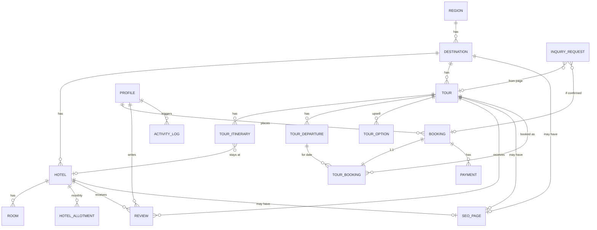

# 01 — ERD tổng quan

> **Vai trò đọc**: DBA, Tech Lead, BA muốn nhìn nhanh "có những bảng gì, liên kết ra sao".
> **Source of truth**: `travel-web/prisma/schema.prisma`. Doc này phải đồng bộ với schema thật — khi schema đổi, update file này TRƯỚC khi merge.

---

## 5 module (bounded contexts)

| Module | Bảng | Tần suất thay đổi |
| --- | --- | --- |
| **1. Content CMS** | Region, Destination, Hotel, Room, Tour, TourItinerary, TourDeparture, TourOption, HotelAllotment | Cao — content team update hằng tuần |
| **2. Booking & Payment** | Booking, TourBooking, Payment, InquiryRequest | TB — bug fix + Phase 1.5 feature |
| **3. Auth & User** | Profile, ActivityLog | Thấp — chỉ thay khi đổi auth provider |
| **4. Review** | Review (polymorphic) | Thấp — tăng feature Phase 1.5 |
| **5. Platform** | SeoPage (polymorphic), HomeSetting, SystemSetting, LegalContent | TB — admin update tuỳ campaign |

**Tổng**: 20 bảng (sau migration `add_pricing_options_and_allotment`).

---

## ERD Mermaid



---

## Danh sách 20 bảng

| # | Bảng | Module | Vai trò ngắn |
| --- | --- | --- | --- |
| 1 | `profiles` | Auth | Mirror Supabase Auth user, lưu role + display name |
| 2 | `activity_logs` | Auth | Audit trail mọi mutation admin |
| 3 | `regions` | Content | 3 miền cố định (mb/mt/mn), seed cứng |
| 4 | `destinations` | Content | Điểm đến (Đà Lạt, Sapa, …) |
| 5 | `hotels` | Content | Hotel partner — **content reference**, không bookable |
| 6 | `rooms` | Content | Loại phòng trong hotel |
| 7 | `tours` | Content | Sản phẩm tour package (entity trung tâm) |
| 8 | `tour_itineraries` | Content | Lịch trình từng ngày (có gắn `hotelId`) |
| 9 | `tour_departures` | Content | Lịch khởi hành cụ thể + slot |
| 10 | `tour_options` | Content | Upsell (room upgrade, single supplement, add-on) |
| 11 | `hotel_allotments` | Content | Allotment monthly cho mỗi hotel |
| 12 | `bookings` | Booking | Đơn đặt chỗ tour (must-login, `paymentDeadline` 15-min hold) |
| 13 | `tour_bookings` | Booking | Detail 1:1 với Booking + `priceBreakdown` Json |
| 14 | `payments` | Booking | Giao dịch thanh toán |
| 15 | `inquiry_requests` | Booking | Lead capture Private Tour / Corporate |
| 16 | `reviews` | Review | Đánh giá polymorphic (Hotel / Tour) |
| 17 | `seo_pages` | Platform | Metadata SEO override polymorphic |
| 18 | `home_settings` | Platform | Cấu hình trang chủ (singleton) |
| 19 | `system_settings` | Platform | Cấu hình key/value |
| 20 | `legal_contents` | Platform | Trang pháp lý (T&C, Privacy) |

> **Đã DROP** khỏi schema (YAGNI — ADR-001): `hotel_bookings`, `Booking.bookingType`, `Booking.checkIn`/`checkOut`, enum `BookingType`. Vivu không bán hotel độc lập kể cả Phase 2.

---

## Cascade matrix (onDelete)

| Parent → Child | onDelete | Lý do |
| --- | --- | --- |
| Region → Destination | `Cascade` | Region xoá hiếm (seed cứng), destination thuộc nó vô nghĩa |
| Destination → Hotel | `Cascade` | Hotel không tồn tại độc lập |
| Destination → Tour | `SetNull` | Tour có thể đứng riêng tạm thời |
| Destination → SeoPage | `Cascade` | SEO orphan-free |
| Hotel → Room | `Cascade` | Room thuộc hotel |
| Hotel → HotelAllotment | `Cascade` | Allotment thuộc hotel |
| Hotel → SeoPage | `Cascade` | — |
| Hotel → TourItinerary | `SetNull` | Hotel xoá thì itinerary giữ, admin update sau |
| Tour → TourItinerary | `Cascade` | Itinerary thuộc tour |
| Tour → TourDeparture | `Cascade` | Departure thuộc tour |
| Tour → TourOption | `Cascade` | Option thuộc tour |
| Tour → Review | `Cascade` | Review theo target |
| Tour → SeoPage | `Cascade` | — |
| TourDeparture → TourBooking | FK only (no cascade) | Không xoá departure khi có booking |
| Profile → Booking | **`Restrict`** | Vi phạm tax audit nếu xoá user mà mất booking history (ADR-007) |
| Profile → Review | **`Restrict`** | Giữ social proof + SEO content |
| Profile → ActivityLog | `SetNull` | Audit giữ lại, anonymize user |
| Profile → InquiryRequest.assignedTo | `SetNull` | Admin nghỉ việc → gỡ assignee, giữ inquiry |
| Booking → TourBooking | `Cascade` | Detail thuộc booking |
| Booking → Payment | `Cascade` | Payment thuộc booking |
| InquiryRequest → Tour | `SetNull` | Tour xoá vẫn giữ inquiry record |
| InquiryRequest → Booking (`convertedBookingId`) | `SetNull` | Booking huỷ vẫn giữ trail inquiry |
| Review → Hotel/Tour | `Cascade` (cả 2 nhánh polymorphic) | Review xoá theo target |

> **Quy ước**: mọi FK phải khai báo tường minh `onDelete` + `onUpdate`, không dựa default Prisma (nguyên tắc N-04 trong `03-toan-ven-concurrency.md`).

---

## Polymorphic patterns — Exclusive Arc

Vivu dùng **2 chỗ** polymorphic Phase 1 (Review + SeoPage). Cả 2 đều theo pattern **Exclusive Arc** (nhiều cột FK nullable + CHECK constraint), không dùng string slug hoặc single discriminator column.

### Review (HOTEL | TOUR)

```
Review
  ├─ reviewableType: ENUM(HOTEL, TOUR)
  ├─ hotelId: UUID? (FK Hotel)
  └─ tourId:  UUID? (FK Tour)

CHECK `reviews_target_exclusive`:
  (reviewableType=HOTEL AND hotelId IS NOT NULL AND tourId IS NULL)
   OR
  (reviewableType=TOUR  AND tourId  IS NOT NULL AND hotelId IS NULL)
```

### SeoPage (TOUR | DESTINATION | HOTEL | STATIC)

```
SeoPage
  ├─ targetType: ENUM(TOUR, DESTINATION, HOTEL, STATIC)
  ├─ tourId:        UUID? @unique
  ├─ destinationId: UUID? @unique
  ├─ hotelId:       UUID? @unique
  └─ customPath:    String? @unique

CHECK `seo_pages_exclusive_target`:
  Đúng 1 trong 4 cột non-NULL, và khớp với targetType.
```

**Vì sao Exclusive Arc thay vì string slug?**
- Slug có thể đổi khi admin chỉnh URL → SeoPage orphan
- FK theo ID bất biến → không orphan
- DB-level enforcement qua CHECK constraint

---

## Concurrency hotspots

Phase 1 chỉ có **1 chỗ** cần concurrency control nghiêm túc:

```
TourDeparture.bookedCount  (counter chia sẻ)
```

**Scenario lỗi**: 2 khách book cùng departure khi còn 1 slot.

**Giải pháp**: Pessimistic lock `SELECT ... FOR UPDATE` trong `prisma.$transaction({ isolationLevel: Serializable })`. Chi tiết → `03-toan-ven-concurrency.md`.

---

## Visibility — entity nào có `isActive`

| Entity | Có `isActive` | Cascade hide xuống |
| --- | :---: | --- |
| Region | ❌ (seed cứng) | — |
| Destination | ✅ | Hotel + Tour (filter ở service layer) |
| Hotel | ✅ | Room |
| Room | ✅ | — |
| Tour | ✅ | Itinerary + Departure (children không cần riêng) |
| TourOption | ✅ | — |
| TourDeparture | dùng `status` ENUM thay vì `isActive` | — |

**Index convention**: mọi `is_active` dùng **partial index** `WHERE is_active = true`, không full Boolean column. Chi tiết → `03-toan-ven-concurrency.md`.

---

## Naming convention

| Aspect | Convention | Ví dụ |
| --- | --- | --- |
| Model name | PascalCase | `Tour`, `TourDeparture` |
| Field name | camelCase | `createdAt`, `priceFrom` |
| Table name | snake_case plural | `tours`, `tour_departures` |
| Column name | snake_case | `created_at`, `price_from` |
| ID type | UUID (`@db.Uuid`) — ADR-003 | — |
| Slug | Có khi cần SEO URL | `slug @unique` |
| Boolean visibility | **`isActive`** (không dùng `isPublished`, `isVisible`) | — |
| Timestamps | `createdAt` + `updatedAt` cho mọi mutable entity | — |
| FK field | `<entity>Id` camel | `tourId`, `destinationId` |
| Map directive | Mọi field cần `@map("snake_case")` | — |

---

## Liên kết

- Spec từng bảng: `02-thiet-ke-bang.md`
- Toàn vẹn + concurrency + visibility (4 nguyên tắc DB): `03-toan-ven-concurrency.md`
- Quy trình migration: `04-quy-trinh-migration.md`
- Migration sắp tới: `migrations/2026-05-27_add_pricing_options_and_allotment.md`
- ADR liên quan: `../02-kien-truc/decisions/ADR-001`, `ADR-003`
