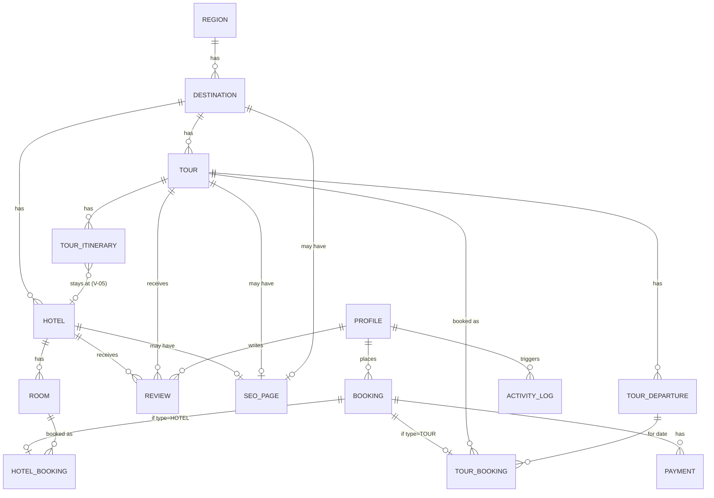

# Sơ Đồ Dữ Liệu (ERD) — Vivu Travel

> **Phiên bản:** 2.3 · **Ngày:** 26/05/2026 · **Tier:** 4 (Data)
>
> File này là **bản đồ tổng quan** của database. Nó trả lời câu:
> "Hệ thống có những thực thể nào, chúng liên kết với nhau ra sao?"
>
> Chi tiết từng bảng (field, type, constraint, index) ở file
> [`03-thiet-ke-du-lieu-chi-tiet.md`](./03-thiet-ke-du-lieu-chi-tiet.md).
>
> **Source of truth thực tế:** [`travel-web/prisma/schema.prisma`](../../../travel-web/prisma/schema.prisma).
> File doc này phải luôn đồng bộ với schema thật. Khi schema đổi → cập
> nhật file này TRƯỚC khi merge code.

---

## 1. Tổng quan — 5 nhóm thực thể (Bounded Contexts)

Hệ thống được chia thành **5 nhóm chức năng** (gọi là *bounded
contexts*). Mỗi nhóm có thể thay đổi tương đối độc lập với nhóm khác.

```
┌────────────────────────────────────────────────────────────────────┐
│  1. CONTENT             2. BOOKING                3. AUTH          │
│  ──────────             ──────────                ──────           │
│  Region                 Booking                   Profile          │
│  Destination            TourBooking               Role enum        │
│  Hotel + Room           Payment                   ActivityLog      │
│  HotelAllotment ★NEW    InquiryRequest ★NEW                       │
│  Tour                                                              │
│  TourOption ★NEW         4. PLATFORM               5. REVIEW       │
│  TourItinerary           ──────────                ──────          │
│  TourDeparture           SystemSetting             Review          │
│                          HomeSetting               (polymorphic)   │
│                          SeoPage (polymorphic)                     │
│                          LegalContent                              │
└────────────────────────────────────────────────────────────────────┘

★ NEW = Tables thêm khi apply migration `add_pricing_options_and_allotment`
       (V-09 + V-10 + V-12)
✘ DROP = HotelBooking + bookingType + Booking.checkIn/checkOut (YAGNI - V-05)
```

| Context | Mô tả ngắn | Thay đổi thường xuyên? |
| --- | --- | --- |
| **Content CMS** | Region, Destination, Hotel/Room, **HotelAllotment** (monthly), Tour + **TourOption** (upsell) + Itinerary + Departure | Cao — content team update hằng tuần |
| **Booking & Payment** | Booking (TOUR-only) + paymentDeadline hold, TourBooking, Payment, **InquiryRequest** (Private Tour lead capture) | Trung — bug fix + Phase 1.5 feature |
| **Auth & User** | Profile mirror Supabase Auth, Role, ActivityLog | Thấp — chỉ thay khi đổi auth provider |
| **Platform / Settings** | System config, Home config, SEO override, Legal | Trung — admin update tuỳ campaign |
| **Review** | Đánh giá đa hình tour / hotel | Thấp — tăng feature Phase 1.5 |

---

## 2. ERD tổng — quan hệ chính giữa các thực thể

```
┌──────────┐  1:N  ┌─────────────┐  1:N  ┌──────┐   1:N   ┌────────┐
│ Region   ├──────►│ Destination ├──────►│ Tour ├────────►│Itinerary│
│ (3 cố    │       │ isActive    │       │ isAct│         │ +hotelId│ ← GAP
│  định)   │       │ isFeatured  │       │      │         │  (V-05) │
└──────────┘       └──────┬──────┘       └──┬───┘         └─────────┘
                          │1:N              │1:N
                          ▼                 ▼
                       ┌──────┐         ┌────────────┐
                       │Hotel │         │ Departure  │
                       │isAct │         │ bookedCount│ ← concurrency hot path
                       └──┬───┘         │ FOR UPDATE │
                          │1:N          └─────┬──────┘
                          ▼                   │1:N
                       ┌──────┐                ▼
                       │Room  │            ┌──────────────┐
                       └──┬───┘            │ TourBooking  │
                          │1:N             │ (polymorphic)│
                          ▼                └──────┬───────┘
                  ┌──────────────┐                 │
                  │ HotelBooking │                 │
                  │ (polymorphic)│                 │
                  └──────┬───────┘                 │
                         │                         │
                         │     ┌─────────┐         │
                         └────►│ Booking │◄────────┘
                               │ +userId │
                               │ +type   │ ← CHECK exclusive
                               └────┬────┘
                                    │1:N
                                    ▼
                               ┌─────────┐
                               │ Payment │
                               └─────────┘

┌──────────┐  1:N  ┌────────┐
│ Profile  ├──────►│Booking │   (must-login, V-04)
│ (Supabase│ ──────► Review  (1:N polymorphic Hotel|Tour, CHECK exclusive)
│  mirror) │ ──────► ActivityLog (SetNull on delete)
└──────────┘

┌─────────┐  exclusive arc (V-03 SEO-first)
│ SeoPage ├─► Tour       (tourId)
│         ├─► Destination(destinationId)
│         ├─► Hotel      (hotelId)
│         └─► custom path (customPath)   ← CHECK seo_pages_exclusive_target
└─────────┘

┌──────────────┐  ┌──────────────┐  ┌──────────────┐
│ HomeSetting  │  │SystemSetting │  │ LegalContent │
│ (singleton)  │  │ (key/value)  │  │ (slug-based) │
└──────────────┘  └──────────────┘  └──────────────┘
```

**Ghi chú đọc sơ đồ:**

- `1:N` = một-tới-nhiều. Vd Region 1:N Destination = 1 region có nhiều destination.
- `polymorphic` = quan hệ đa hình (Review = HOTEL hoặc TOUR. SeoPage = TOUR/DESTINATION/HOTEL/STATIC).
- `exclusive arc` = đa hình **chuẩn DB-level**: thay vì 1 cột chứa nhiều
  loại reference, dùng nhiều cột FK nullable + CHECK constraint ép đúng
  1 cột non-null tại một thời điểm.
- `FOR UPDATE` = lock pessimistic, chống race condition khi book.

---

## 3. ERD Mermaid (để render đẹp trong docs site)



> **Lưu ý:** Mermaid trên thể hiện **state mục tiêu sau Đợt 2 migration**
> (đã có `TourItinerary.hotelId`). Schema hiện tại chưa có quan hệ đó —
> sẽ add ở migration `add_tour_itinerary_hotel`.

---

## 4. Liệt kê toàn bộ tables hiện có (snapshot 26/05/2026)

| # | Table | Context | Vai trò ngắn |
| --- | --- | --- | --- |
| 1 | `profiles` | Auth | Mirror user từ Supabase Auth, lưu role + display name |
| 2 | `activity_logs` | Auth | Audit trail mọi mutation admin |
| 3 | `regions` | Content | 3 miền cố định (mb/mt/mn), seed cứng |
| 4 | `destinations` | Content | Điểm đến du lịch (Đà Lạt, Sapa, …) |
| 5 | `hotels` | Content | Hotel partner — content reference (V-05) |
| 6 | `rooms` | Content | Loại phòng trong hotel |
| 7 | `tours` | Content | Sản phẩm tour package (entity chính) |
| 8 | `tour_itineraries` | Content | Lịch trình từng ngày của tour |
| 9 | `tour_departures` | Content | Lịch khởi hành cụ thể + inventory slot |
| 10 | `tour_options` ★NEW | Content | Upsell options (room upgrade, single supplement, add-on) — V-09 |
| 11 | `hotel_allotments` ★NEW | Content | Allotment tháng cho mỗi hotel (admin nhập tay) — V-10 |
| 12 | `bookings` | Booking | Đơn đặt chỗ TOUR-only (DROP bookingType + checkIn/checkOut) + paymentDeadline hold |
| 13 | `tour_bookings` | Booking | Detail TourBooking 1:1 với Booking + priceBreakdown JSON |
| 14 | `payments` | Booking | Giao dịch thanh toán |
| 15 | `inquiry_requests` ★NEW | Booking | Lead capture form cho Private Tour / Corporate Group — V-12 |
| 16 | `reviews` | Review | Đánh giá polymorphic (Hotel/Tour) |
| 17 | `seo_pages` | Platform | Metadata SEO override polymorphic |
| 18 | `home_settings` | Platform | Cấu hình trang chủ (Home Builder) |
| 19 | `system_settings` | Platform | Cấu hình key/value cho hệ thống |
| 20 | `legal_contents` | Platform | Trang pháp lý (T&C, Privacy) |

~~`hotel_bookings`~~ — **DROP (V-05 YAGNI)**: Vivu không bán hotel độc lập kể cả Phase 2.

**Tổng:** 20 tables (sau migration `add_pricing_options_and_allotment`).

---

## 5. Cascade behavior matrix — `onDelete` tường minh

Đây là phần **quan trọng cho data integrity**. Theo blueprint V — quy
tắc 4: *"Referential action (`onDelete`/`onUpdate`) phải khai báo
tường minh"*. Snapshot hiện tại:

| Parent → Child | onDelete | Lý do |
| --- | --- | --- |
| Region → Destination | `Cascade` | Region xoá hiếm xảy ra (seed cứng). Nếu xoá → destination thuộc nó vô nghĩa |
| Destination → Hotel | `Cascade` | Hotel không tồn tại độc lập với destination |
| Destination → Tour | `SetNull` (implicit) | Tour có thể đứng riêng tạm thời. Khôi phục lại bằng cách gán destination khác |
| Hotel → Room | `Cascade` | Room thuộc về hotel |
| Tour → TourItinerary | `Cascade` | Itinerary thuộc về tour |
| Tour → TourDeparture | `Cascade` | Departure thuộc về tour |
| Profile → Booking | `Cascade` | User xoá → booking xoá theo (Phase 1.5 cân nhắc Anonymize) |
| Profile → Review | `Cascade` | User xoá → review xoá |
| Profile → ActivityLog | `SetNull` | Audit log GIỮ LẠI khi user xoá, chỉ null userId |
| ~~Booking → HotelBooking~~ | DROP V-05 | Hotel không bookable, kể cả Phase 2 |
| Booking → TourBooking | `Cascade` | Detail thuộc booking |
| Booking → Payment | `Cascade` | Payment thuộc booking |
| TourDeparture → TourBooking | (no cascade, FK only) | Không xoá departure khi có booking |
| Tour → SeoPage | `Cascade` | SeoPage tự dọn khi tour xoá (V-03) |
| Destination → SeoPage | `Cascade` | Tương tự |
| Hotel → SeoPage | `Cascade` | Tương tự |
| Review → Tour/Hotel | `Cascade` (cả 2 nhánh polymorphic) | Review xoá theo target |

**Lưu ý anti-pattern đã tránh:**

- ❌ Trước: `ActivityLog.profile` dựa vào Prisma default → không rõ.
- ✅ Sau: Khai báo tường minh `onDelete: SetNull` (Issue 2 fix).

---

## 6. Polymorphic patterns được dùng

Vivu dùng **2 chỗ polymorphic** Phase 1 (Review + SeoPage) — mỗi chỗ
đi theo pattern **Exclusive Arc** (không phải string slug, không phải
JSON, không phải single discriminator column).

> **Note:** Booking đã từng là polymorphic (`HOTEL | TOUR`) trong schema
> legacy. Sau pivot V-05 (Hotel = content reference vĩnh viễn), DROP
> HotelBooking + bookingType. Booking giờ chỉ có TourBooking 1:1 — KHÔNG
> còn polymorphic.

### 6.1 ~~Booking polymorphic (HOTEL | TOUR)~~ — DROP (V-05 YAGNI)

> **Legacy:** Booking từng có `bookingType` enum + `HotelBooking` child model.
> Pivot V-05: Hotel = content reference vĩnh viễn, Vivu không bán hotel
> độc lập kể cả Phase 2. → **DROP `HotelBooking` + `bookingType` enum +
> `Booking.checkIn/checkOut`**. Booking giờ luôn = TourBooking 1:1.
>
> Schema final: `Booking + TourBooking (1:1)` đơn giản, không cần discriminator.

### 6.2 Review polymorphic (HOTEL | TOUR)

```
Review
  ├─ reviewableType: ENUM(HOTEL, TOUR)
  ├─ hotelId: UUID? (FK Hotel)
  └─ tourId:  UUID? (FK Tour)

CHECK constraint `reviews_target_exclusive`:
  (reviewableType=HOTEL AND hotelId IS NOT NULL AND tourId IS NULL)
   OR
  (reviewableType=TOUR  AND tourId  IS NOT NULL AND hotelId IS NULL)
```

### 6.3 SeoPage polymorphic (TOUR | DESTINATION | HOTEL | STATIC)

```
SeoPage
  ├─ targetType: ENUM(TOUR, DESTINATION, HOTEL, STATIC)
  ├─ tourId:        UUID? @unique
  ├─ destinationId: UUID? @unique
  ├─ hotelId:       UUID? @unique
  └─ customPath:    String? @unique

CHECK constraint `seo_pages_exclusive_target`:
  Đúng 1 trong 4 cột non-NULL, và phải khớp với targetType.
```

> **Vì sao Exclusive Arc thay vì string slug?** Slug có thể đổi khi
> admin chỉnh URL → SeoPage orphan. FK theo ID bất biến → không orphan.
> Chi tiết: xem [`10-chien-luoc-seo.md`](./10-chien-luoc-seo.md).

---

## 7. Concurrency hotspots — chỗ có race condition

Chỉ có **1 chỗ** trong Phase 1 cần concurrency control nghiêm túc:

```
TourDeparture.bookedCount  (counter chia sẻ)
```

**Scenario lỗi:** 2 khách book cùng departure cùng lúc khi còn 1 slot.

**Giải pháp:** Pessimistic lock (`SELECT ... FOR UPDATE`) trong
`prisma.$transaction({ isolationLevel: Serializable })`.

Chi tiết: [`08-chien-luoc-concurrency.md`](./08-chien-luoc-concurrency.md).

---

## 8. Visibility patterns — `isActive` cascade

Theo blueprint V — quy tắc *visibility flag consistency*: mọi entity
public-facing có `isActive`. Hiện trạng:

| Entity | Có `isActive` | Cascade hide xuống |
| --- | :---: | --- |
| Region | ❌ (cố định) | — |
| Destination | ✅ | Hotel + Tour (filter ở service layer) |
| Hotel | ✅ | Room (filter ở service layer) |
| Room | ✅ | — |
| Tour | ✅ | Itinerary + Departure (children không cần riêng) |
| TourDeparture | (dùng `status` ENUM thay vì `isActive`) | — |

Chi tiết: [`09-chien-luoc-visibility.md`](./09-chien-luoc-visibility.md).

---

## 9. Naming convention

Lock từ blueprint, không đổi giữa phase:

| Aspect | Convention | Ví dụ |
| --- | --- | --- |
| Model name | PascalCase | `Tour`, `TourDeparture` |
| Field name | camelCase | `createdAt`, `priceFrom` |
| Table name (DB) | snake_case plural | `tours`, `tour_departures` |
| Column name (DB) | snake_case | `created_at`, `price_from` |
| ID | UUID `@default(uuid())` | — |
| Slug | Có khi cần SEO URL | `slug @unique` |
| Boolean visibility | **`isActive`** (không dùng `isPublished`, `isVisible`) | — |
| Timestamps | `createdAt` + `updatedAt` cho mọi mutable entity | — |
| FK field | `<entity>Id` camel | `tourId`, `destinationId` |
| Map directive | Mọi field cần `@map("snake_case")` | — |
| Polymorphic exclusive arc | Nhiều cột nullable + CHECK constraint | (xem section 6) |

---

## 10. Gap hiện tại cần fix khi vào migration mới

Đây là **danh sách thay đổi schema** sẽ thực hiện. Gộp vào **1 migration lớn**:
`add_pricing_options_and_allotment` (V-05 + V-08 + V-09 + V-10).

### Thay đổi field hiện có

| # | Thay đổi | Trace anchor | Lý do |
| --- | --- | --- | --- |
| 1 | Thêm `TourItinerary.hotelId` (nullable FK Hotel, `SetNull`) | V-05 | Gắn hotel vào từng ngày của tour combo |
| 2 | Thêm `TourItinerary.roomTypeNote` (String?) | V-05 | Note "Deluxe Twin" hoặc tương tự — không FK Room vì có thể đổi |
| 3 | Thêm `createdAt` + `updatedAt` cho `TourItinerary` | Backlog #9 | Audit track |
| 4 | Thêm `Tour.estimatedCost` (Decimal? nullable) | V-08 | Chừa cửa cho L1/L2 reporting |
| 5 | Thêm `Tour.priceAdult` (Decimal NOT NULL — migrate từ priceFrom) | V-09 | Pricing per-pax Pattern C |
| 6 | Thêm `Tour.priceChild` / `priceInfant` / `singleSupplement` (Decimal?) | V-09 | — |
| 7 | Thêm `TourDeparture.minParticipants` (Int? nullable) | V-10 | Tối thiểu để khởi hành — chống wash |
| 8 | Thêm `TourDeparture.cancellationDeadline` (DateTime?) | V-10 | Hạn cuối Vivu quyết cancel |
| 9 | Thêm `TourDeparture.cancellationReason` (String?) | V-10 | Lý do cancel để email khách + audit |
| 10 | Thêm `TourDeparture.actualCostPerPax` (Decimal? nullable) | V-08 | Chi phí thực sau chuyến |
| 11 | Thêm `Booking.paymentDeadline` (DateTime?) | V-10 | = createdAt + 15min, cron auto-cancel |
| 12 | DROP `TourBooking.unitPrice` (Decimal) | V-09 | Thay bằng `priceBreakdown` Json (chi tiết hơn) |
| 13 | Thêm `TourBooking.adultsCount` / `childrenCount` / `infantsCount` (Int) | V-09 | Tách số khách theo độ tuổi |
| 14 | Thêm `TourBooking.priceBreakdown` (Json NOT NULL) | V-09 | Chi tiết tính tiền có thể truy lại |
| 15 | Thêm `Room.roomType` (enum RoomType, default STANDARD) | Schema hygiene | Standardize loại phòng (9 giá trị chuẩn) cho filter |
| 16 | Thêm `Tour.durationNights` (Int, default 0) + DROP `Tour.durationText` | Schema hygiene | Structured thay vì free-text. Util `formatDuration()` ở app layer |
| 17 | **DROP `HotelBooking` table** + DROP `Booking.bookingType` + DROP `Booking.checkIn`/`checkOut` + DROP enum `BookingType` | V-05 YAGNI | Vivu không bán hotel độc lập kể cả Phase 2 |

### Tables mới

| # | Table mới | Trace anchor | Vai trò |
| --- | --- | --- | --- |
| 18 | `tour_options` | V-09 | Upsell options của tour (room upgrade, single supplement, add-on) |
| 19 | `hotel_allotments` | V-10 | Allotment monthly cho mỗi hotel (admin nhập tay đầu tháng) |
| 20 | `inquiry_requests` | V-12 | Lead capture cho Private Tour / Corporate Group — admin xử lý manual |

### CHECK constraints mới

| # | Constraint | Trace anchor |
| --- | --- | --- |
| 17 | `tour_bookings_participants_consistency`: `participants = adultsCount + childrenCount + infantsCount` | V-09 |
| 18 | `tour_bookings_at_least_one_adult`: `adultsCount >= 1` | V-09 |
| 19 | `hotel_allotments_no_overuse`: `usedRooms + releasedRooms <= contractedRooms` | V-10 |
| 20 | `tours_duration_valid`: `duration_days >= 1 AND duration_nights >= 0 AND duration_nights <= duration_days` | Schema hygiene |
| ~~21~~ | ~~`bookings_phase1_tour_only`~~ — KHÔNG cần (DROP bookingType column) | V-05 |

---

## 11. Mapping tới anchor decisions

| Bounded context | Trace tới anchor V-XX |
| --- | --- |
| Content CMS (Tour-centric) | V-01 (MVP tour-only), V-05 (Hotel content ref) |
| Booking & Payment | V-04 (must-login → `Booking.userId NOT NULL`), V-02 (B2C direct, không split) |
| Auth & User | V-04 (must-login), V-06 (team 2-3 dev → audit log quan trọng) |
| Platform / Settings | V-03 (SEO-first → SeoPage), V-08 (reporting chừa cửa) |
| Review | V-01 (tour-only, hotel chỉ Phase 1.5+) |

---

## Changelog

| Ngày | Version | Thay đổi |
| --- | --- | --- |
| (cũ) | 1.0 | Stub 20 dòng, lệch code: Region.code, không có polymorphism, không có Hotel/Booking detail |
| 26/05/2026 | 2.0 | **Viết lại từ đầu** khớp schema thật. 18 tables, 5 bounded contexts, 3 polymorphic exclusive arc. Khai báo cascade matrix. Note 5 gap cần fix Đợt 2.2. Trace V-01 → V-08. |
| 26/05/2026 | 2.1 | Sau khi user research industry: scope mở rộng từ "Plan A" → **"Plan A+"**. Thêm 2 tables (`tour_options` + `hotel_allotments`) → tổng **20 tables**. Update gap list từ 5 lên **16 thay đổi + 2 tables mới + 4 CHECK constraints** (bao gồm: standardize `Room.roomType` enum 9 giá trị + restructure `Tour.duration` thành `durationDays + durationNights`, DROP `durationText`). Trace V-09 + V-10 + schema hygiene. |
| 26/05/2026 | 2.2 | Thêm anchor **V-12** (Series + Private Tour split) sau khi user raise case "công ty 40 người" — không ghép đoàn được. Thêm table **`inquiry_requests`** vào BOOKING context → tổng **21 tables**. Update Section 10 gap list (16 thay đổi + 3 tables mới + 4 CHECK). |
| 26/05/2026 | 2.3 | **YAGNI pivot (V-05 vĩnh viễn)**: DROP `hotel_bookings` + `Booking.bookingType` + `Booking.checkIn/checkOut` + enum `BookingType` khỏi schema. Tổng schema còn **20 tables**. Polymorphic patterns còn 2 (Review + SeoPage), Booking không còn polymorphic. Section 10 gap list thêm thay đổi #17 (DROP legacy). Update ERD ASCII + cascade matrix + Section 6 (đánh dấu 6.1 DROP). |

---

*File này thuộc **Tier 4 (Data)** — overview. Chi tiết:*

- *Per-module schema: [`03-thiet-ke-du-lieu-chi-tiet.md`](./03-thiet-ke-du-lieu-chi-tiet.md)*
- *Integrity rules: [`06-quy-tac-toan-ven-du-lieu.md`](./06-quy-tac-toan-ven-du-lieu.md)*
- *Concurrency: [`08-chien-luoc-concurrency.md`](./08-chien-luoc-concurrency.md)*
- *Visibility: [`09-chien-luoc-visibility.md`](./09-chien-luoc-visibility.md)*
- *SEO: [`10-chien-luoc-seo.md`](./10-chien-luoc-seo.md)*
